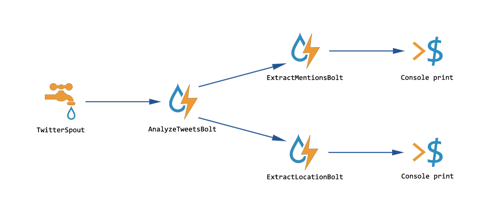
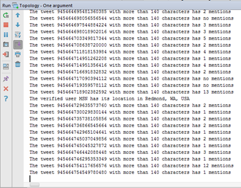

# Training Apache Storm

The purpose of this project is get a global vision about how Apache Storm works. 

## Structure

The structure of the topology created is as follows:

1. TwitterSpout spout receives tweets streaming which match the pattern established using the library Twitter4j.
2. AnalyzeTweetsBolt receives the tweets from the spout and filter between tweets with more than 140 characters and tweets written by verified accounts. In the first case the results will be emited over an stream called _status_, and in the second case the results will be emited over an stream called _user_. 
3. ExtractMentionsBolt receives the stream _status_ from AnalyzeTweetsBolt and prints id and the number of mentions for each tweet.
4. ExtractLocationBolt receives the stream _user_ from AnalyzeTweetsBolt and, if the location contains a predefined pattern, prints in console.

## Execution

To execute the project follow this steps (the easiest way):
1. Clone this repo.
2. Open project with your favorite IDE.
3. Rename/copy `src/main/resources/twitter4j.properties.example` by `twitter4j.properties` and set your Twitter keys. You can create an app for Twitter [here](https://apps.twitter.com/).
4. Set in run configuration the word/words you want to set as filter. Try with popular words (e.g. "_Donald Trump_"), hashtags in TT... to watch the real-time effect
5. Run and enjoy! You should see something like this:

## Credits

Ángel Francisco Sánchez Granados
Ingeniería de Datos - Big Data
Máster en Ingeniería Informática - URJC - 2017/18